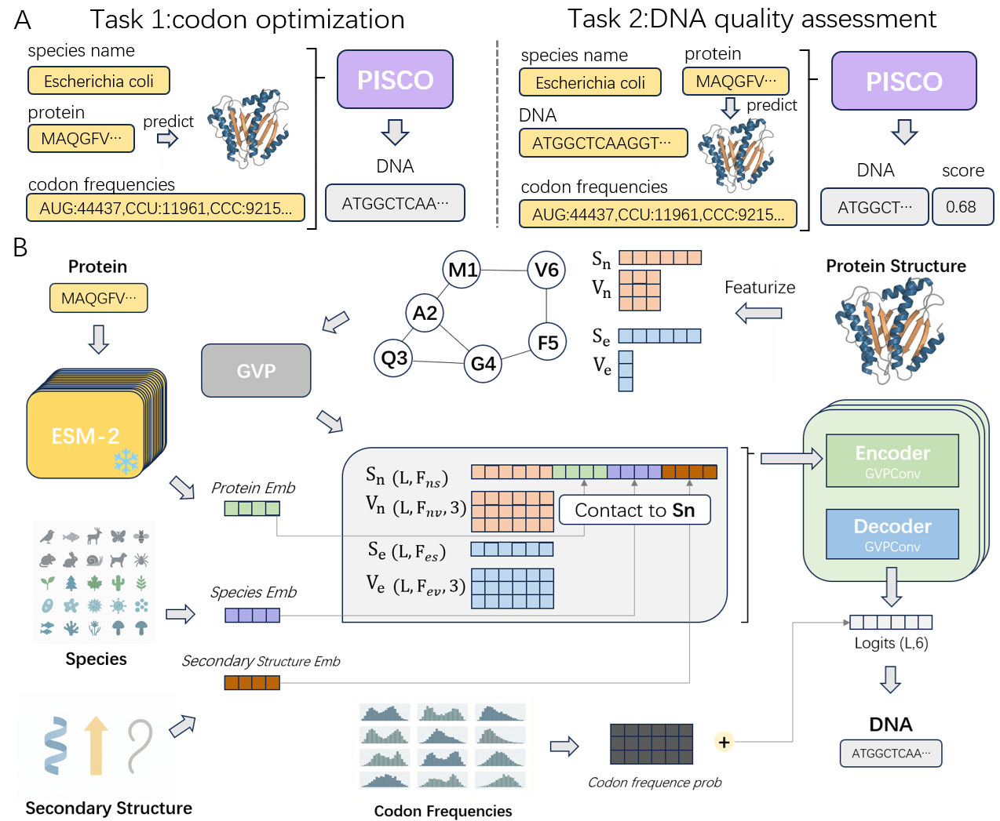

# PISCO

**P**rotein **S**tructure **I**nformed **S**pecies-specific **C**odon **O**ptimization

PISCO is a deep learning model for **species-aware codon optimization** that integrates:

- protein sequence
- protein 3D structure
- organism-specific codon usage

to generate optimized synonymous codon sequences.

## Model Architecture


---

# Installation

## Create environment

```bash
conda create -n pisco python=3.10 -y
conda activate pisco
```

## Install PyTorch (CUDA 12.4)

```bash
pip install torch==2.6.0 \
--index-url https://download.pytorch.org/whl/cu124
```

## Install PyTorch Geometric

```bash
pip install torch_scatter torch_sparse torch_cluster \
-f https://data.pyg.org/whl/torch-2.6.0+cu124.html
```

## Install remaining dependencies

```bash
pip install -r requirements.txt
```

---

# Model Checkpoints

Pretrained models are hosted on Hugging Face.

### Finetuned Model

https://huggingface.co/zero9998/PISCO-finetune

### Pretrained Model

https://huggingface.co/zero9998/PISCO-pretrain

Example usage:

```bash
--checkpoint zero9998/PISCO-finetune
```

The model will automatically download from Hugging Face.

---

# Inference

The goal of inference is to generate an **optimized RNA codon sequence** for a given protein.

Two modes are supported depending on whether reliable structures are available.

---
## Case 1: Quick Test

You can directly use the preprocessed test dataset `data/dataset_test.jsonl`, which already contains structural data.

```bash
python infer.py \
--checkpoint zero9998/PISCO-finetune \
--test_input data/dataset_test.jsonl \
--test_output result/test_result.csv
```

The predicted RNA sequences will appear in the:

```
predicted_rna
```

column of the output CSV file.

---

## Case 2: PDB Mode

You can also use a CSV file as input together with PDB structure files for inference (see `./data/Rubisco_AlphaFold_database.csv` and `./data/pdb/` for reference).

The input CSV must contain a column:

```
pdb_path
```

which points to the corresponding `.pdb` files.

Run:

```bash
python infer.py \
--checkpoint zero9998/PISCO-finetune \
--test_input data/Rubisco_AlphaFold_database.csv \
--test_output result/Rubisco_result.csv \
--pdb_mode
```

# Output Metrics

The output CSV contains:

| Column | Description |
|------|------|
| predicted_rna | predicted optimized RNA |
| predicted_score | model preference score |
| predicted_CSI | codon similarity index |
| predicted_GC% | GC content |
| predicted_CFD | codon frequency distribution |
| predicted_COUSIN | codon usage similarity |

When comparing different protein sequences:

**Higher `predicted_score` indicates a better codon sequence according to the model.**

---

# Training

## Pretraining

```bash
python run_hf.py --train
```

With species distribution:

```bash
python run_hf.py --train --use-sd
```

---

## Finetuning

```bash
python finetune.py \
--pretrained ./models_hf/pretrain_xxx
```

Species distribution version:

```bash
python finetune.py \
--pretrained ./models_hf/pretrain_xxx \
--use-sd
```

---

# Project Structure

```
PISCO
│
├─ data/
│  ├─ pdb/
│  ├─ dataset_test.jsonl
│  ├─ Rubisco_AlphaFold_database.csv
├─ pisco/
│  ├─ models
│  ├─ data
├─ result/
├─ src/
├─ codon_frequencies_kazusa.jsonl
├─ Codon_Usage_kazusa.csv
├─ infer.py
└─ requirements.txt
```

---

# License

This software is licensed under a dual-license model:
1. Academic License: Free for use in academic research, teaching, and non-profit projects. 
2. Commercial License: Required for any commercial or for-profit use.

Definitions:
- Academic Use: Usage by educational institutions, students, and non-profit research projects.
- Commercial Use: Usage for any profit-making activity or by commercial entities.

For more information or to obtain a commercial license, please contact us at license@moleculemind.com

Full License Text: [TODO: Link to License Document]
